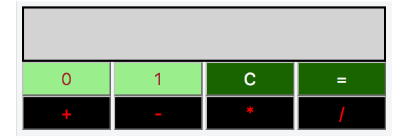
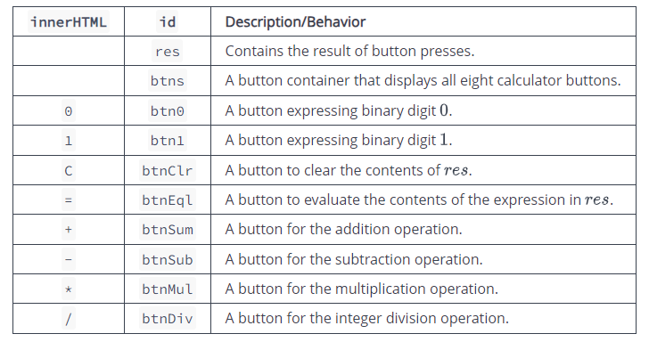
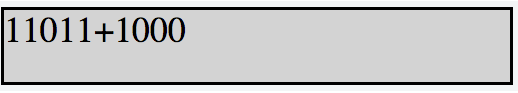
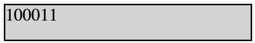
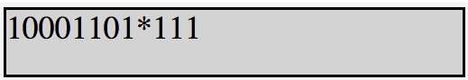
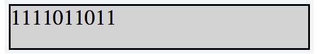
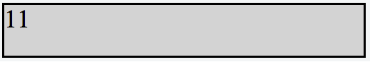

# Objective

In this challenge, we implement a calculator that uses binary numbers. Check out the attached tutorial for learning materials.

# Task

Implement a simple calculator that performs the following operations on *binary numbers*: addition, subtraction, multiplication, and division. Note that division operation must be *integer division* only; for example, 1001/100 = 10, 1110/101 = 10, and 101/1 = 101.

The calculator's initial state must look like this:


- Element IDs. Each element in the document must have an id, specified below:


- Styling. The document's elements must have the following styles:
  - body has a width of 33%.
  - res has a background-color of lightgray, a border that is solid, a height of 48px, and a font-size of 20px.
  - btn0 and btn1 have a background-color of lightgreen and a color of brown.
  - btnClr and btnEql have a background-color of darkgreen and a color of white.
  - btnSum, btnSub, btnMul, and btnDiv have a background-color of black, a color of red.
  - All the buttons in btns have a width of 25%, a height of 36px, a font-size of 18px, margin of 0px, and float value left.

The .js and .css files are in different directories, so use the link tag to provide the CSS file path and the script tag to provide the JS file path:
```
<!DOCTYPE html>
<html>
    <head>
        <link rel="stylesheet" href="css/binaryCalculator.css" type="text/css">
    </head>
    
    <body>
    	<script src="js/binaryCalculator.js" type="text/javascript"></script>
    </body>
</html>
```

# Constraints

- All expressions in the test dataset are entered in the form operand1 -> operator -> operand2, where operand1 is the first binary number, operand2 is the second binary number, and operator is in the set {+, -, *, =}.
- Both operands will always be positive integers when converted from base-2 to base-10.
- All expressions will be valid.

# Explanation

Consider the following sequence of button clicks:
```
1 -> 1 -> 0 -> 1 -> 1 -> + -> 1 -> 0 -> 0 -> 0 ->=
```
Before pressing the = button, the result div looks like this:


After pressing the = button to evaluate our expression, the result div looks like this:


Notice that (11011)<sub>2</sub> = (27)<sub>10</sub>, (1000)<sub>2</sub> = (8)<sub>10</sub>, and (100011)<sub>2</sub> = (35)<sub>10</sub>, so our calculator evaluated the expression correctly.

Now, let's consider our next sequence of button clicks as:
```
0 -> 1 -> * -> 1 -> 1 -> 1 ->=
```
Before pressing the = button, the result div looks like this:


After pressing the = button to evaluate our expression, the result div looks like this:


Consider the next sequence of button clicks as:
```
C -> 1 -> 1
```

The result div looks like this:


# Input Format

Locked stub code in the editor reads variable `s` from stdin and passes it to the function.

# Output Format

You must write two print statements using `console.log()`:

1. Print the contents of a caught exception's *message* on a new line. If no exception was thrown, this line should not be printed.
2. Print `s` on a new line. If no exception was thrown, then this should be the reversed string; if an exception was thrown, this should be the original string.

# Sample Input 0

```
"1234"
```

# Sample Output 0

```
4321
```

# Explanation 0

`s = "1234"` is a string type, so it can be reversed without throwing an exception. Thus, we print the reversed value, 4321, as our answer.

# Sample Input 1

```
Number(1234)
```

# Sample Output 1

```
s.split is not a function
1234
```

# Explanation 1

`s = Number(1234)` is not a string type, so it can't be reversed using string functions. When we try to reverse it anyway, it throws an exception. We then catch the exception and print its , which is `s.split is not a function`. Next, we finally print  which, because it wasn't able to be reversed, is `Number(1234)`.